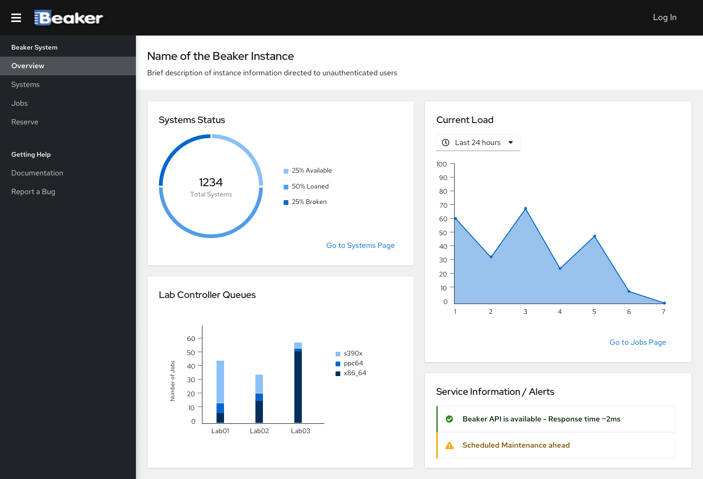

# Main Dashboard

Designs for the landing Dashboard of beaker.

## Unauthenticated user

When any unauthenticated user opens the beaker web interface, a dashboard is shown with main information about:

- State of the machines in the instance (available, loaned, broken, reserved) as well as a link to systems page
- Current load of jobs/recipies running, with possible historical data
- Available Lab Controllers and queue size for those
- General information or alerts can also be shown

