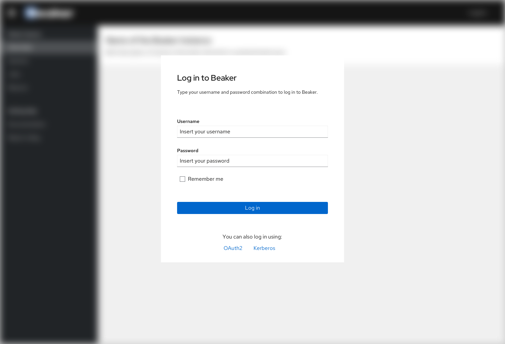
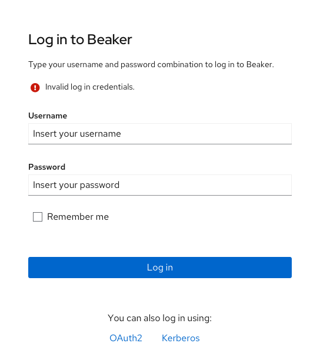
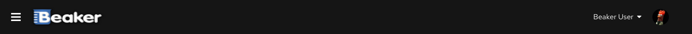

# Login Screens

Unauthenticated users will have a button in the upper-right corner of the interface to Log in.

Direct authentication with Kerberos token should be available.
For those who do not have any form of automatic authentication configured, a login modal will be shown asking for username and password.

If the user inserts an invalid combination of username and password, an error will appear in the modal informing something went wrong.

If the user inserts a valid combination of usename and password, the login will succeed and the name of the user will be visible, with the profile picture, in the top right place where the login button used to be.

