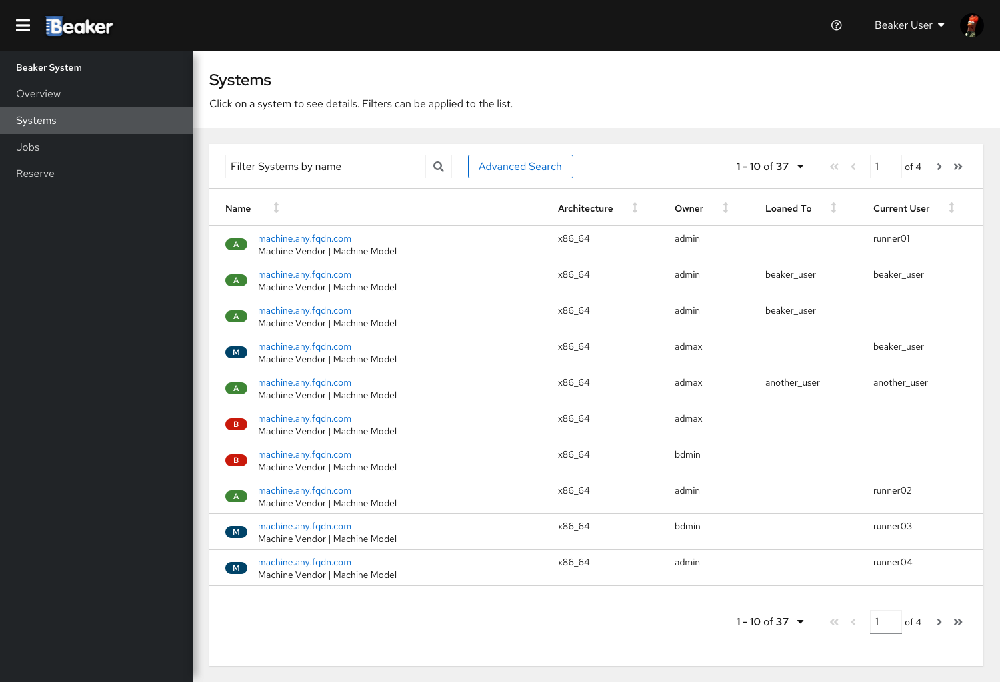
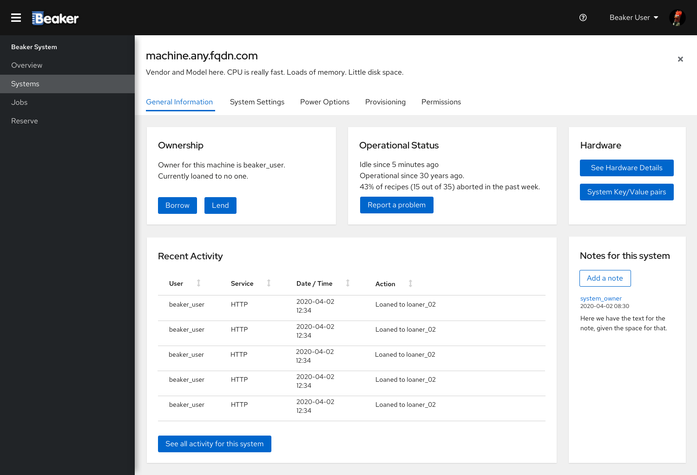

# Systems Screen

When a user clicks the "Systems" option in the main menu, the Systems screen shows a table with the systems in Beaker.
The table contains 10 results per page. There are navigation commands which can be used to go through the pages.

There is a filter bar which can be used to search for specific systems by name. Other filtering options will be available
through "Advanced Search".

The table contains 5 fields:
- Name: name of the system in Beaker, with the machine vendor and model
- Architecture: architecture(s) supported in this system
- Owner: user who owns the system in Beaker
- Loaned To (optional): User who got the system through loan, if any
- Current User: User who is running something in the system, if any

## System details - General Information

When a user clicks a system in the table presented in the Systems screen, the details for that system are presented.
Clicking the 'x' in the top-right corner of the screen sends the user back to the Systems screen.
A horizontal submenu groups all of the configuration and information for the system by subject.

The first details screen has the general information about the system. It contains 5 cards:
- Ownership: informs who is the owner for this system and if is there any active loan. Also has buttons for borrowing
the system or lending it to someone, given the current user has the proper permissions to do so.
- Operational Status: has the current status for this system and the amount of aborted recipes in the past week. Also has
a "Report Problem" button, allowing the current user to inform the machine owner of any problem that may have happened.
- Hardware: Has a button to show the hardware details for this system and a button to show the key/value pairs defined
for the system.
- Notes: notes about the system, written by anyone with permissions to do so.
- Recent Activity: small report of the recent activity in the system. The last 5 activities are shown. There is a button
which allows the user to see all the activity for the system.

The recent activity table has 4 fields:
- User: name of the user who triggered / executed the activity
- Service: shows through which service (command line, web interface) the activity was created
- Date / Time: timestamp for the activity
- Action: Description of the activity and its effects

